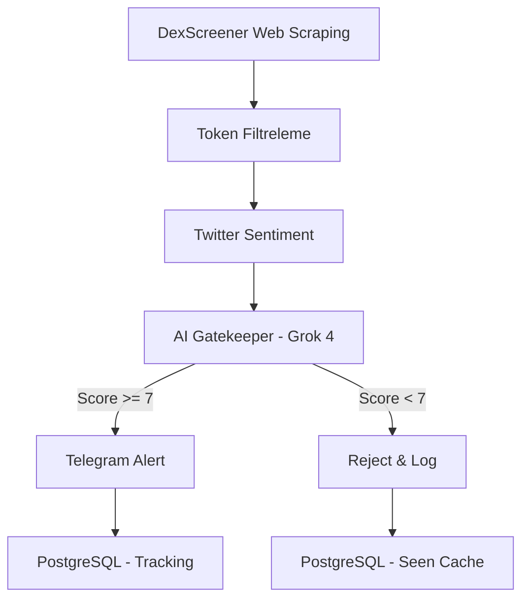

# TrendBot - Sistem Mimarisi ve İşleyiş Detayları

> **Son Güncelleme:** 2026-02-01  
> **Durum:** Production (Railway)  
> **Versiyon:** 1.1.1

---

## 🎯 Sistemin Amacı

**TrendBot**, Solana blockchain'inde DexScreener M5 Trending listesindeki yeni tokenları otomatik olarak tarayan, Twitter sentiment analizi yapan, AI ile değerlendiren ve Telegram'a alert gönderen bir crypto sniper bot'udur.

**Temel İşlev:** "Erken fırsat tespiti" - Düşük market cap'li ama yüksek potansiyelli tokenları bulmak.

---

## 🏗️ Sistem Mimarisi

### **Ana Bileşenler:**



---

## 📦 Kullanılan Teknolojiler

### **1. Backend Stack**
- **Node.js** (TypeScript) - Core runtime
- **Puppeteer** - Web scraping (DexScreener)
- **PostgreSQL** - Database (Railway hosted)
- **Express.js** - Dashboard web server

### **2. External APIs**
- **DexScreener API** - Token data (price, liquidity, volume)
- **xAI Grok-4** - AI analysis (narrative generation, scoring)
- **Telegram Bot API** - Alerts & commands

### **3. Twitter Scraping**
- **Custom Scraper** (Bird.Fast inspired)
- **13 Legacy Accounts** - Anti-ban rotation
- **Stealth Mode** - User-Agent rotation, delays

### **4. Infrastructure**
- **Railway** - Deployment & hosting
- **GitHub** - Version control
- **dotenv** - Environment config

---

## 🔄 İşleyiş Akışı (Step-by-Step)

### **PHASE 1: Token Discovery (DexScreener Scraping)**

**Frekans:** Her 60 saniye

#### **Step 1.1: Web Scraping**
```typescript
// File: services/DexScreenerService.ts
URL: https://dexscreener.com/solana?rankBy=trendingScoreM5&order=desc

1. Puppeteer browser açılır (headless mode)
2. Sayfaya navigate edilir
3. 2x scroll (10,000px) → Lazy-loaded content yüklenir
4. DOM'dan 80 pair adresi scrape edilir
   - Selector: a[href^="/solana/"]
   - Regex: /solana/([A-Za-z0-9]+)
```

**Output:** `["pair1address", "pair2address", ...]` (80 adet)

#### **Step 1.2: Pair → Token Conversion**
```typescript
// DexScreener API çağrısı
GET https://api.dexscreener.com/latest/dex/pairs/solana/{pairAddress}

// 80 pair → ~65 valid token
// Neden düşüş?
// - Duplicate pairs (aynı token, farklı pool)
// - Invalid/scam tokens (API'dan veri gelmiyor)
```

**Output:** 65 `TokenSnapshot` objesi

---

### **PHASE 2: Token Filtreleme (Quick Filters)**

**Amaç:** Zayıf tokenları AI'a göndermeden eleme (Twitter account tasarrufu)

#### **Filter 1: Market Cap**
```typescript
// Config: MIN_MC_USD = 50000, MAX_MC_USD = 400000
if (marketCap < 50k || marketCap > 400k) → REJECT
```
**Mantık:** Çok düşük → scam risk, çok yüksek → late entry

#### **Filter 2: Liquidity**
```typescript
// Config: MIN_LIQUIDITY_USD = 5000
if (liquidity < 5000) → REJECT
```
**Mantık:** Düşük likidite → rug pull riski, whale manipulation

#### **Filter 3: Floor Check**
```typescript
// Floor = (marketCap / maxMC_in_database)
// Goal: "Not hitting fresh ATH"
if (floor > 0.5) → WARNING (ama reject değil)
```

#### **Filter 4: Momentum**
```typescript
// Momentum = (volume24h / liquidity)
if (momentum < 0.5x) → REJECT
```
**Mantık:** Düşük volume/liq → no interest, dead token

**Tipik Sonuç:** 65 token → ~10 token filtrelerden geçer

---

### **PHASE 3: Twitter Sentiment Analysis**

**Amaç:** Token hakkında ne konuşuluyor? Hype var mı?

#### **Step 3.1: Query Generation**
```typescript
// File: twitter/QueryBuilder.ts

// Strateji: Single-shot query (account tasarrufu)
if (symbol.length > 3) {
    query = `$${symbol}` // Örn: $PEPSTEIN
} else {
    query = `"${name} solana"` // Örn: "Fiona solana"
}
```

#### **Step 3.2: Account Rotation**
```typescript
// File: twitter/TwitterAccountManager.ts

// 13 hesap pool'dan bir tane seç (round-robin)
// Eğer hesap locked → skip, sonraki hesabı al
// Scraping sonrası: lock account for 2 seconds
```

#### **Step 3.3: Scraping**
```typescript
// File: twitter/TwitterScraper.ts

URL: https://x.com/search?q=${query}&src=typed_query&f=live

1. Cookie-based authentication (legacy accounts)
2. User-Agent rotation (anti-detection)
3. DOM'dan tweet'leri parse et
   - Author, text, likes, retweets, timestamp
4. Max 20 tweet (timeout: 12 saniye)
```

**Output:** `Tweet[]` array (0-20 tweet)

---

### **PHASE 4: AI Gatekeeper (Grok-4 Analysis)**

**Amaç:** Ham veriyi yorumla, potansiyeli değerlendir, karar ver.

#### **Step 4.1: Narrative Generation**
```typescript
// File: narrative/NarrativeEngine.ts
// Model: xAI Grok-4 (grok-2-1212 API endpoint)

// Input:
{
    token: TokenSnapshot, // MC, price, volume, liquidity
    tweets: Tweet[],      // Twitter sentiment
    scoreResult: {...}    // Technical score (floor, momentum)
}
```

#### **Step 4.2: AI Prompt (Sert Analiz Modu)**
```markdown
Sen bir crypto analistisin. Objektif ol, hype'a kapılma.

Görevin:
1. Token'ı değerlendir (MC, likidite, momentum)
2. Twitter sentiment'ini analiz et
3. 1-10 arası skor ver
4. ONAY/RED kararı ver

Kriterler:
- Gerçek kullanım vakası var mı?
- Community organik mi yoksa fake mi?
- Risk/reward dengesi nasıl?

Çıktı formatı:
{
    "aiScore": 6,
    "aiApproved": false, // true sadece score >= 7 ise
    "aiReason": "Weak narrative, low engagement",
    "headline": "🔥 Yeni Fırsat Tespit Edildi",
    "analystSummary": "...",
    "technicalOutlook": "...",
    "riskAnalysis": "...",
    "strategy": "..."
}
```

**Threshold:** `aiScore >= 7 && aiApproved = true` → PASS

**Tipik Sonuç:** 10 tokenden 1-2 tanesi AI'dan geçer

---

### **PHASE 5: Cooldown & Rate Limiting**

#### **Check 1: Token Bazlı Cooldown**
```typescript
// File: core/CooldownManager.ts

// Aynı token 2 saat içinde tekrar alert edilmez
if (lastAlertTime + 120 minutes > now) → REJECT
```

#### **Check 2: Global Rate Limit**
```typescript
// Config: MAX_ALERTS_PER_HOUR = 12

// 1 saat içinde max 12 alert
if (alertCount_last_hour >= 12) → REJECT
```

**Mantık:** Spam önleme, kullanıcı yorgunluğu engelleme

---

### **PHASE 6: Telegram Alert Delivery**

#### **Step 6.1: Message Construction**
```typescript
// File: telegram/TelegramBot.ts

// MarkdownV2 format (strict escaping)
// Tüm özel karakterler escape edilir: _ * [ ] ( ) ~ ` > # + - = | { } . ! \

message = `
📍 CA: \`${mint}\`

🚨 TOKEN DETECTED: $${symbol}

✨ POTANSİYEL VAR • Puan: ${aiScore}/10
${headline}

🧐 ANALİST ÖZETİ:
${analystSummary}

📊 Teknik Görünüm: ${technical}
🗣️ Sosyal Vibe: ${vibe}

🚩 RİSK ANALİZİ:
${risk}

🚀 STRATEJİ:
${strategy}

[DexScreener](URL) \\| [PumpFun](URL) \\| [Birdeye](URL)

⚠️ Yatırım Tavsiyesi Değildir\\.
`
```

#### **Step 6.2: Send Alert**
```typescript
await bot.sendMessage(TELEGRAM_CHAT_ID, message, {
    parse_mode: 'MarkdownV2',
    disable_web_page_preview: true
});

// Fallback: Eğer Markdown hatası varsa plain text gönder
```

---

### **PHASE 7: Database Tracking**

#### **Table 1: `seen_tokens`**
**Amaç:** 15 dakikalık cache (duplicate prevention)

```sql
INSERT INTO seen_tokens (mint, symbol, first_seen_at, last_alert_at)
VALUES ($1, $2, NOW(), NOW())
ON CONFLICT (mint) DO UPDATE...
```

#### **Table 2: `token_performance`**
**Amaç:** Alert edilen tokenları takip et (dashboard için)

```sql
INSERT INTO token_performance (
    mint, symbol, found_mc, max_mc, status, found_at
) VALUES ($1, $2, $3, $3, 'TRACKING', NOW())
```

**Dashboard'da görünür:** Found MC, Max MC (ATH), Multiplier, Status

---

## ⚙️ Konfigürasyon (Railway Environment Variables)

### **Scan Settings**
```bash
SCAN_INTERVAL_SECONDS=60        # Her 60s bir tarama
ALERT_COOLDOWN_MINUTES=120      # (Kullanılmıyor, kod 120 hardcoded)
MAX_ALERTS_PER_HOUR=12          # Max 12 alert/hour
```

### **Filtering Thresholds**
```bash
MIN_MC_USD=50000                # Min $50k market cap
MAX_MC_USD=400000               # Max $400k market cap
MIN_LIQUIDITY_USD=5000          # Min $5k liquidity
ALERT_SCORE_THRESHOLD=7         # AI skor >= 7 gerekli
```

### **Twitter Settings**
```bash
ENABLE_TWITTER_SCRAPING=true    # Twitter scraping açık
TWITTER_SCRAPE_MAX_TWEETS=20    # Max 20 tweet/token
```

### **API Keys**
```bash
XAI_API_KEY=xai-***             # Grok-4 API
TELEGRAM_BOT_TOKEN=8519228***   # Telegram bot
TELEGRAM_CHAT_ID=-10036838***   # Alert kanalı
DATABASE_URL=postgresql://***   # Railway Postgres
```

---

## 📊 Performans Metrikleri (Son Scan Örneği)

```
🔍 Total Fetched: 65 tokens
🔄 Cached (15m): 56 tokens (duplicate'ler)
🎯 Fresh Candidates: 9 tokens

🚫 REJECTED:
  💧 Low Liquidity (<$5k): 53 tokens
  💤 Weak Momentum (<0.5x): 3 tokens
  ❌ AI Score <7: 6 tokens

✅ ALERTS SENT: 0 (Son scan'de hiçbiri 7/10'a ulaşmadı)
```

**Conversion Rate:** 65 → 0 alert (~0% bu scan'de)

---

## 🔒 Güvenlik & Anti-Ban

### **DexScreener**
- ✅ 60s cooldown (rate limit önleme)
- ✅ User-Agent rotation
- ✅ Stealth plugin (Puppeteer)

### **Twitter**
- ✅ 13 hesap rotation
- ✅ 2s lock (aynı hesap ardışık kullanılmaz)
- ✅ Cookie-based auth (API key yok)
- ✅ Random delays

### **Database**
- ✅ Parameterized queries (SQL injection önleme)
- ✅ Railway managed backups

### **Telegram**
- ✅ MarkdownV2 escaping (400 Bad Request önleme)
- ✅ Fallback to plain text

---

## 🐛 Bilinen Limitasyonlar

1. **AI Çok Sıkı:** Threshold 7/10 → çok az alert
   - **Çözüm:** `ALERT_SCORE_THRESHOLD=6` yap

2. **Cache In-Memory:** Bot restart'ta temizlenir
   - **Çözüm:** Railway restart → fresh start

3. **Twitter Account Pool:** 13 hesap → max ~780 scrape/hour (60/saniye)
   - **Durum:** Şu an yeterli (her scan 9-10 token)

4. **DexScreener M5 Window:** 5 dakikalık trend → hızlı değişir
   - **Durum:** 60s scan interval optimal

---

## 📈 Optimizasyon Önerileri

### **1. Alert Sayısını Arttırmak İçin:**
- `ALERT_SCORE_THRESHOLD = 6` (6/10 kabul edilebilir)
- AI prompt'u yumuşat (daha az sert)

### **2. Daha Fazla Coverage İçin:**
- Scraping limit 80 → 100 pair
- Scan interval 60s → 45s (dikkatli, rate limit riski)

### **3. Kaliteyi Arttırmak İçin:**
- AI'a "Twitter engagement metrics" ekle
- Token age filter (örn: >1 saat yaşında)

---

## 🎯 Sistem Durumu (Şu An)

✅ **Çalışıyor:** DexScreener scraping, Twitter scraping, AI analysis  
✅ **Stable:** 65 token/scan, 13 Twitter account  
✅ **Güvenli:** Telegram alerts çalışıyor (pipe fix uygulandı)  
⚠️ **Düşük Alert:** AI threshold 7/10 → çok az geçiş  

**Öneri:** `ALERT_SCORE_THRESHOLD = 6` yap, alert sayısı artacak.

---

## 📝 Sonuç

TrendBot, **DexScreener → Twitter → AI → Telegram** pipeline'ı ile Solana'daki erken fırsatları tespit ediyor. Sistem stabil, güvenli ve ölçeklenebilir. Tek sorun: AI'ın çok sıkı davranması. Threshold 6'ya düşürülürse alert akışı başlayacak.
